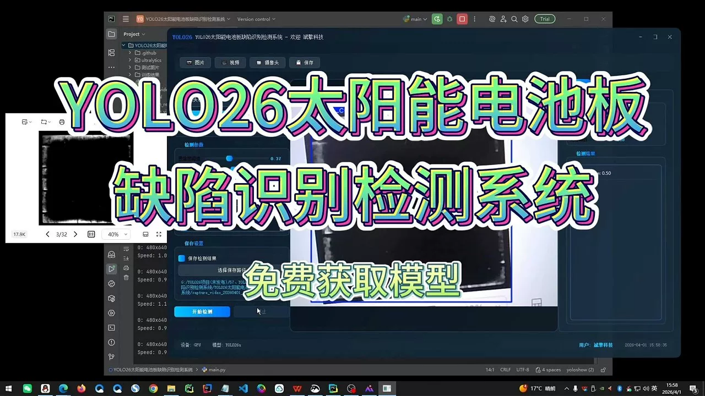
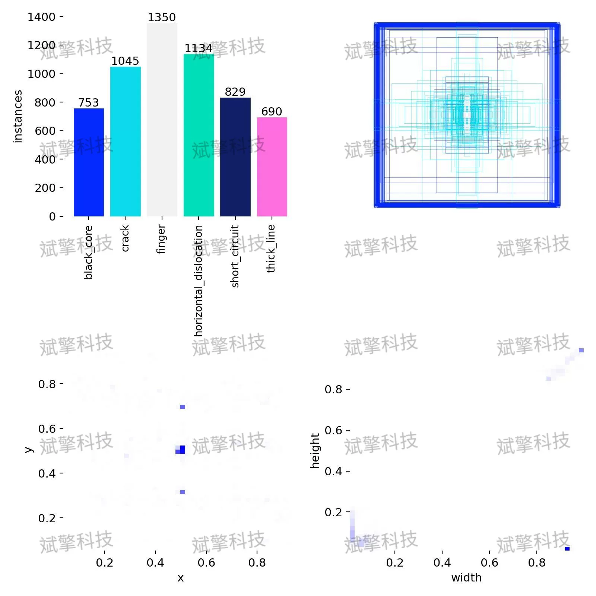
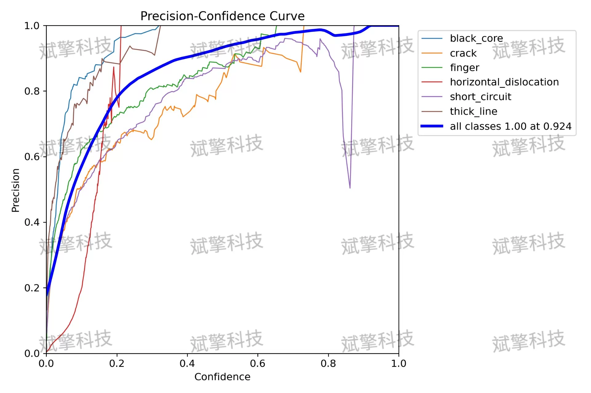
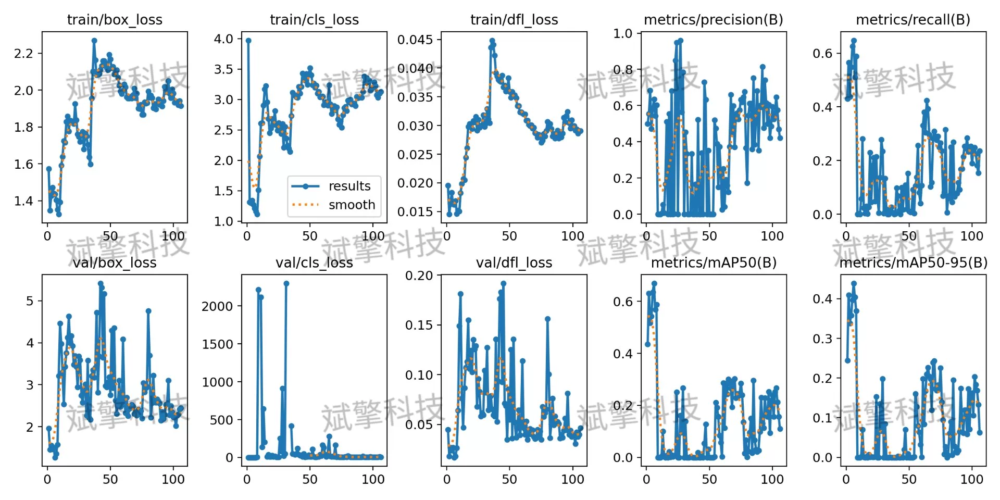
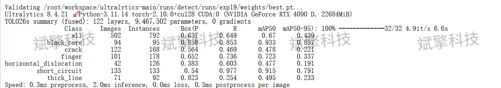
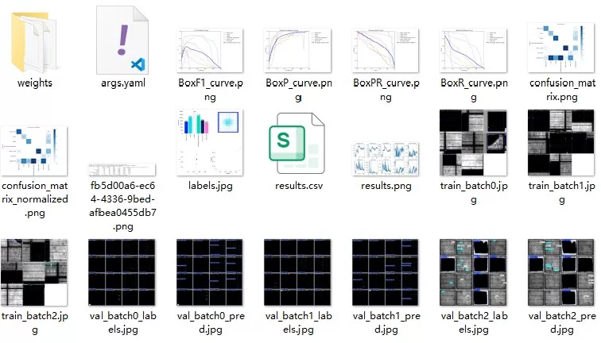
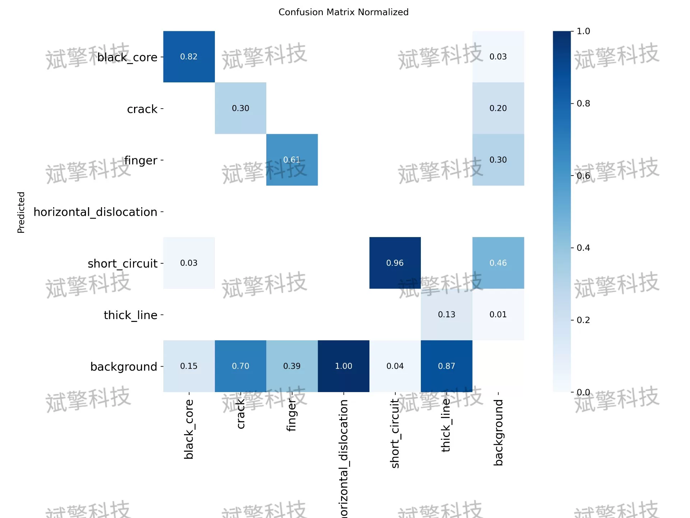
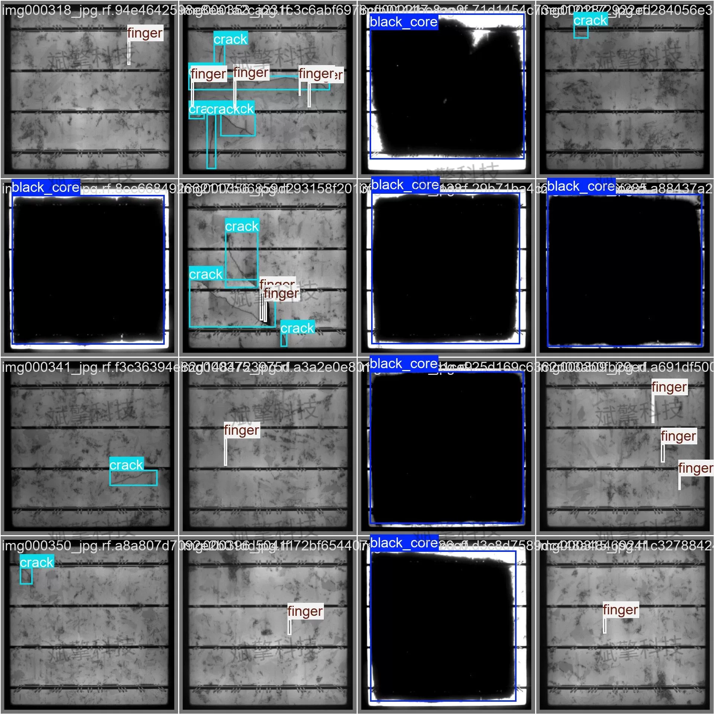
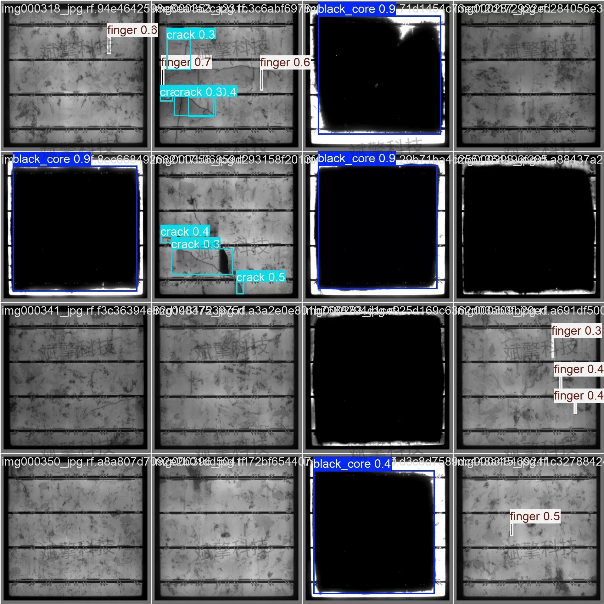

# YOLO26 solar panel defect detection system

## Body

YOLO26 Solar Panel Defect Detection System - Industrial Quality Assurance

With the rapid development of the photovoltaic industry, the quality control of solar panels has become a crucial link to ensure power generation efficiency. Addressing the issues of low efficiency and subjectivity in traditional manual inspections, this paper proposes an automatic detection system for small-sized solar panel defects based on the YOLO26 (You Only Look Once) deep learning algorithm. The study constructs a dataset containing six typical defect categories: black core, crack, finger, horizontal dislocation, short circuit, and thick line, totaling 5016 images. Despite challenges in detecting fine cracks and horizontal dislocations, the overall system demonstrates great potential for real-time, automated defect screening in industrial production lines.

The dataset consists of 5016 labeled images, divided into training sets, validation sets, and test sets according to scientific proportions to ensure sufficient model training and objective evaluation results. The specific division is as follows:
Training set: 3512 images, used for learning and updating model parameters.
Validation set: 502 images, used for adjusting hyperparameters during training and monitoring model performance in real time.
Test set: 1002 images, used for final assessment of the generalization ability of the model.

The dataset includes six specific defect categories, covering various issues from material itself to manufacturing processes:
Black Core (BK): refers to dark spots appearing in the center area of the solar cell, often associated with reduced minority carrier lifetime, severely affecting photoelectric conversion efficiency.
Crack (CR): refers to physical cracks appearing on the surface of the solar cell, potentially causing short circuits or hotspots.
Finger (FH): refers to the fracture or poor printing of the thin fingers collecting current on the surface of the solar cell.
Horizontal Dislocation (HD): refers to the horizontal position offset occurring during the laminating or stacking process of the solar cell.
Short Circuit (SC): refers to severe functional defects where the positive and negative electrodes of the solar cell are abnormally connected.
Thick Line (TL): refers to the situation where the width of the electrode lines printed in the process exceeds the standard range, affecting the shaded area and conductive performance.

Free reservation for remote installation. Unsuccessful installation will result in a full refund.
Purchase comes with the following resources (accessed automatically through Baidu Pan):
YOLO recognition detection project complete source code
YOLO format datasets
Training code + UI interface code
Trained model + results images
Software installer
Add WeChat for remote installation (automatically displayed after purchase) - Unsuccessful, full refund

⚙️ Core Function Modules
Detection Capabilities
Image Detection: Upon upload, returns detection boxes + category information
Video Detection: Supports video files, analyzes frames accurately
Camera Real-Time Detection: Connects to USB cameras, achieves dynamic monitoring
Interaction and Control
Target Filtering: Choose one or more categories for detection
Parameter Real-Time Adjustment: Adjustable confidence threshold & IoU threshold, flexible control precision
Result Saving: Saves images/videos/camera detection results in one click
System and Data
User Registration and Login: Supports password strength check + encrypted storage
Log Recording: Auto-records operation and error information (timestamped)

## Images

## Payment

Here is a pay link on Stripe ( https://buy.stripe.com/3cs8yP7sY87d0vu9AB ). Please contact me lonlonago@foxmail.com after funding $89, and I will send you a complete data files , thank you!

